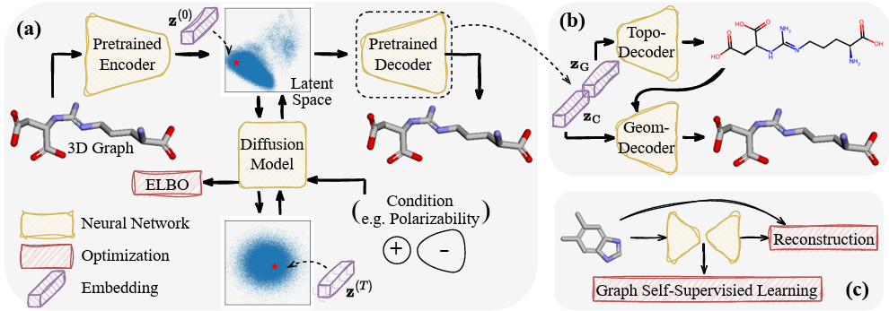
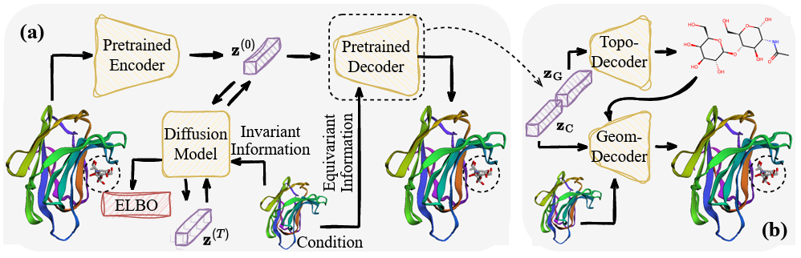

# Latent 3D Graph Diffusion

PyTorch implementation for [Latent 3D Graph Diffusion](https://openreview.net/forum?id=cXbnGtO0NZ)

Yuning You, Ruida Zhou, Jiwoong Park, Haotian Xu, Chao Tian, Zhangyang Wang, Yang Shen

In ICLR 2024.

License: GPL-3.0 (If you are interested in a different license, for example, for commercial use, please contact us.)

## Overview
A pipeline to compress 3D graphs into the latent space, where a (vectorial) diffusion model is implemented to capture the distribution.





## 1. Unconditional Generation

### Training Topological AE
Config environment following https://github.com/wengong-jin/hgraph2graph#installation, or my conda environment file https://github.com/Shen-Lab/LDM-3DG/blob/main/environment_topo_ae.yml. Specifically, ```rdkit=2019.03.4``` if you would like to use my trained checkpoints (related issue: https://github.com/wengong-jin/hgraph2graph/issues/44).
(```rdkit-pypi-2020.9.5.2``` might also work)

Download data and trained model weights from https://zenodo.org/records/11005382.
```
cd ./AE_Topology

# get vocabulary for molecular graphs
python get_vocab.py --ncpu 40 < ../AE_topo_weights_and_data/smiles_chembl_mol3d_qm9_drugs.txt > ../AE_topo_weights_and_data/vocab.txt

# preprocess data for more efficient loading
python preprocess.py --train ../AE_topo_weights_and_data/smiles_mol3d_chembl_train.txt --vocab vocab.txt --ncpu 40 --mode single --out_path ../AE_topo_weights_and_data/processed_data_train/
python preprocess.py --train ../AE_topo_weights_and_data/smiles_chembl_mol3d_qm9_drugs.txt --vocab vocab.txt --ncpu 40 --mode single --out_path ../AE_topo_weights_and_data/processed_data/

# train ae
python train_generator_ptl.py  --ddp_num_nodes 1 --ddp_device 1 --train ../AE_topo_weights_and_data/processed_data_train --vocab ../AE_topo_weights_and_data/vocab.txt --save_dir ../AE_topo_weights_and_data/pretrained
# if train ae with gssl
python train_generator_gssl_ptl.py  --ddp_num_nodes 1 --ddp_device 1 --train ../AE_topo_weights_and_data/processed_data_train --vocab ../AE_topo_weights_and_data/vocab.txt --save_dir ../AE_topo_weights_and_data/pretrained_gssl

# generate smiles to emb dictionary
python generate_embedding.py --train ../AE_topo_weights_and_data/processed_data --vocab ../AE_topo_weights_and_data/vocab.txt --ckpt ../AE_topo_weights_and_data/pretrained/last.ckpt --save_fn ../AE_topo_weights_and_data/smiles2emb_dict.pt
```

### Training Geometric AE
Generic environment would work for the following programs, and my conda environment file https://github.com/Shen-Lab/LDM-3DG/blob/main/environment.yml is also provided for reference.

Download trained model weights and generated samples from https://zenodo.org/records/11005378.

```
cd ./AE_Geometry_and_Unconditional_Latent_Diffusion
python main_2dto3d_encoder_decoder.py --ddp_num_nodes 1 --ddp_device 1 --log_dir ../AE_geom_uncond_weights_and_data/job16_decoder_2d_to_3d
# if train ae with gssl
python main_2dto3d_encoder_decoder_gssl.py --ddp_num_nodes 1 --ddp_device 1 --log_dir ../AE_geom_uncond_weights_and_data/job19_decoder_2d_to_3d_gssl
```

### Generating embedding for qm9 and drugs
Download code and generated qm9 latent embeddings from https://zenodo.org/records/11005421.
```
cd ./e3_diffusion_for_molecules
# qm9
python process_qm9.py

# Drug: following steps 1-3 in https://github.com/ehoogeboom/e3_diffusion_for_molecules/tree/main/data/geom#how-to-build-geom-drugs to download data first
python build_geom_dataset.py
```

### Training Diffusion Model
```
cd ./AE_Geometry_and_Unconditional_Latent_Diffusion
# qm9
python main_latent_ddpm_qm9.py --ddp_num_nodes 1 --ddp_device 1 --data_dir ../e3_diffusion_for_molecules/qm9/latent_diffusion/emb_2d_3d --log_dir ../AE_geom_uncond_weights_and_data/job17_latent_ddpm_qm9
# qm9 conditional generation: alpha, Cv, gap, homo, lumo, mu
python main_latent_ddpm_qm9_conditional.py --condition $condition --ddp_num_nodes 1 --ddp_device 1 --data_dir ../e3_diffusion_for_molecules/qm9/latent_diffusion/emb_2d_3d --log_dir ../AE_geom_uncond_weights_and_data/job21_latent_ddpm_qm9_condition_${condition}
# drug
python main_latent_ddpm_drug.py --ddp_num_nodes 1 --ddp_device 1 --data_dir ../e3_diffusion_for_molecules/data/geom --log_dir ../AE_geom_uncond_weights_and_data/job18_latent_ddpm_drug
```

### Sampling
```
cd ./AE_Geometry_and_Unconditional_Latent_Diffusion
python sample1_latent_ddpm_qm9_latent.py --log_dir $log_dir --sample_number $sample_number
# for conditional generation
python sample1_latent_ddpm_qm9_z_conditional.py --log_dir $log_dir --condition $condition

python sample2_latent_ddpm_qm9_2d.py --log_dir $log_dir
python sample3_latent_ddpm_qm9_3d.py --log_dir $log_dir
```

### Evaluating
```
cd ./AE_Geometry_and_Unconditional_Latent_Diffusion
# jupyter notebooks
evaluate_unconditional.ipynb
evaluate_conditional.ipynb
```


## 2. Conditional Generation on Geometric Object
Download data, trained model weights and generated samples from https://zenodo.org/records/11005227, https://zenodo.org/records/11005419.

### Training Topological AE
```
cd ./AE_Topology

# get vocabulary for molecular graphs
python get_vocab.py --ncpu 40 < ../AE_topo_weights_and_data/smiles_plus.txt > ../AE_topo_weights_and_data/vocab_pocket_aware.txt

# preprocess data for more efficient loading
python preprocess.py --train ../AE_topo_weights_and_data/smiles_mol3d_chembl_train.txt --vocab ../AE_topo_weights_and_data/vocab_pocket_aware.txt --ncpu 40 --mode single --out_path ../AE_topo_weights_and_data/processed_data_pocket_train/
python preprocess.py --train ../AE_topo_weights_and_data/smiles_plus.txt --vocab ../AE_topo_weights_and_data/vocab_pocket_aware.txt --ncpu 40 --mode single --out_path ../AE_topo_weights_and_data/processed_data_pocket/

# train ae
python train_generator_ptl.py  --ddp_num_nodes 1 --ddp_device 1 --train ../AE_topo_weights_and_data/processed_data_pocket_train --vocab ../AE_topo_weights_and_data/vocab_pocket_aware.txt --save_dir ../AE_topo_weights_and_data/pocket_pretrained
# if train ae with gssl
python train_generator_gssl_ptl.py  --ddp_num_nodes 1 --ddp_device 1 --train ../AE_topo_weights_and_data/processed_data_pocket_train --vocab ../AE_topo_weights_and_data/vocab_pocket_aware.txt --save_dir ../AE_topo_weights_and_data/pocket_pretrained_gssl

# generate smiles to emb dictionary
python generate_embedding.py --train ../AE_topo_weights_and_data/processed_data_pocket --vocab ../AE_topo_weights_and_data/vocab_pocket_aware.txt --ckpt ../AE_topo_weights_and_data/pocket_pretrained/last.ckpt --save_fn ../AE_topo_weights_and_data/smiles2emb_dict_pocket.pt
```

### Training Geometric AE
Download data following https://github.com/guanjq/targetdiff#data
```
cd ./AE_Geometry_and_Conditional_Latent_Diffusion

# train ae
python -m scripts.train_ae configs/training.yml

# generate 2d and 3d embeddings
python -m scripts.generate_embedding configs/sampling.yml
```

### Training Diffusion Model
```
cd ./AE_Geometry_and_Conditional_Latent_Diffusion

python -m scripts.train_latent_diffusion configs/training.yml
```

### Sampling and evaluating
```
cd ./AE_Geometry_and_Conditional_Latent_Diffusion

# sample latent embeddings
python -m scripts.sample_z configs/training.yml

# reconstruct 2d
python -m scripts.sample_2d

# reconstruct 3d and evaluate ($data_id in {0, 1, ..., 99})
python -m scripts.sample_3d configs/sampling.yml --data_id $data_id
python -m scripts.evaluate outputs --docking_mode vina_score --protein_root data/test_set --data_id $data_id
```


## Acknowledgements

The implementation cannot proceed without referencing https://github.com/ehoogeboom/e3_diffusion_for_molecules, https://github.com/wengong-jin/hgraph2graph, https://github.com/directmolecularconfgen/dmcg, https://github.com/JeongJiHeon/ScoreDiffusionModel, https://github.com/chaitjo/geometric-gnn-dojo, and https://github.com/guanjq/targetdiff.


## Citation

If you use this code for you research, please cite our paper.

```
@inproceedings{you2024latent,
  title={Latent 3D Graph Diffusion},
  author={You, Yuning and Zhou, Ruida and Park, Jiwoong and Xu, Haotian and Tian, Chao and Wang, Zhangyang and Shen, Yang},
  booktitle={International Conference on Learning Representations},
  year = {2024}
}
```

